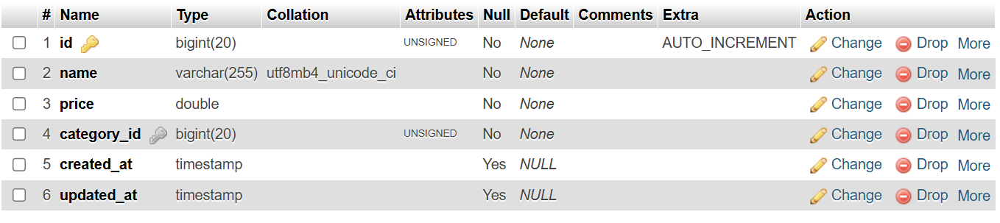

# PManager (Products Manager)

Template buat bikin sistem pengelola produk sederhana menggunakan laravel 12
. Disini projeknya pakai template dari flowbite, silahkan kalau mau bikin style sendiri atau ada preferensi template sendiri dipersilahkan. **Kerjakan todos / tugas-tugas yang diberikan**
## Cara instalasi Projek
1. Jalankan perintah berikut untuk instal modul/package yang diperlukan untuk projek:
```
composer install
npm install
```
2. buat folder .env jika belum ada dan tambahkan kode berikut:
```
APP_NAME=PManager
APP_ENV=local
APP_KEY=base64:xP+yHzH7NeeBhyETTAG0TsUaFZ+mx4GTeLNdvsZYJz8=
APP_DEBUG=true
APP_URL=http://localhost:8000

APP_LOCALE=en
APP_FALLBACK_LOCALE=en
APP_FAKER_LOCALE=en_US

APP_MAINTENANCE_DRIVER=file
# APP_MAINTENANCE_STORE=database

PHP_CLI_SERVER_WORKERS=4

BCRYPT_ROUNDS=12

LOG_CHANNEL=stack
LOG_STACK=single
LOG_DEPRECATIONS_CHANNEL=null
LOG_LEVEL=debug

DB_CONNECTION=mysql
DB_HOST=127.0.0.1
DB_PORT=3306
DB_DATABASE=pmanager
DB_USERNAME=root
DB_PASSWORD=

SESSION_DRIVER=database
SESSION_LIFETIME=120
SESSION_ENCRYPT=false
SESSION_PATH=/
SESSION_DOMAIN=null

BROADCAST_CONNECTION=log
FILESYSTEM_DISK=local
QUEUE_CONNECTION=database

CACHE_STORE=database
# CACHE_PREFIX=

MEMCACHED_HOST=127.0.0.1

REDIS_CLIENT=phpredis
REDIS_HOST=127.0.0.1
REDIS_PASSWORD=null
REDIS_PORT=6379

MAIL_MAILER=log
MAIL_SCHEME=null
MAIL_HOST=127.0.0.1
MAIL_PORT=2525
MAIL_USERNAME=null
MAIL_PASSWORD=null
MAIL_FROM_ADDRESS="hello@example.com"
MAIL_FROM_NAME="${APP_NAME}"

AWS_ACCESS_KEY_ID=
AWS_SECRET_ACCESS_KEY=
AWS_DEFAULT_REGION=us-east-1
AWS_BUCKET=
AWS_USE_PATH_STYLE_ENDPOINT=false

VITE_APP_NAME="${APP_NAME}"

```


3. jalankan perintah generate key berikut:
```
php artisan key:generate
```

4. jalankan perintah berikut untuk migrasi database dan tabel default dari laravel
```
php artisan migrate
```

5. Jalankan perintah berikut untuk memulai development server:
```
composer run dev
```


## Link Dokumentasi
- [Tailwind CSS](https://tailwindcss.com/docs)
- [Laravel 12](https://laravel.com/docs/12.x/)
- [Flowbite](https://flowbite.com/docs)

## Todos / Tugas-Tugas Yang Dikerjakan
1. Buat migration, model, dan controller untuk mengatur produk-produk di Pmanager.
   - Ketentuan Migrasi:
        - Tabel Products <br><br> 
            
            **tabel category_id** memiliki relasi dengan tabel categories
      
        - Tabel Categories <br><br> 
            
            **tabel category_id** memiliki relasi dengan tabel categories
    - Ketentuan Fungsi Controller:
         - Memiliki fungsi CRUD dan sesuai dengan best practice, dengan ketentuan nama fungsi:
           - index -> menampilkan semua data produk (halaman semua produk)
           - create -> menampilkan form tambah produk
           - store -> menambahkan data ke database kemudian redirect ke index (halaman semua produk)
           - edit -> menampilkan form edit produk
           - update -> menyimpan perubahan data produk ke database
           - destroy -> menghapus produk dari database
2. Gunakan named routes / rute yang pakai nama buat memudahkan pas nambahin ke form action nya.
3. Silahkan styling dan kustomisasi halaman menggunakan tailwind sesuai selera. atau kalian bisa pakai template dari flowbite.