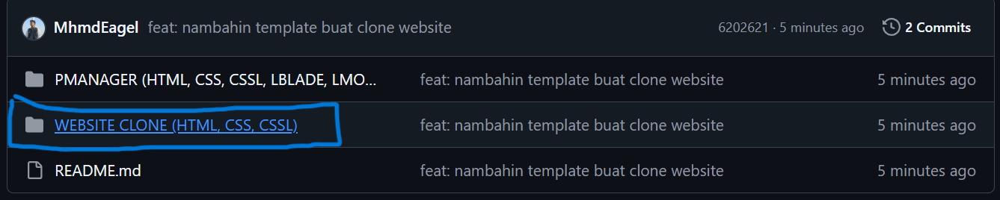
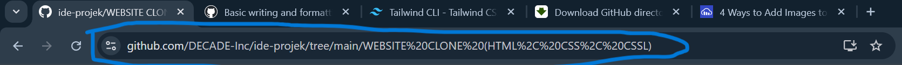
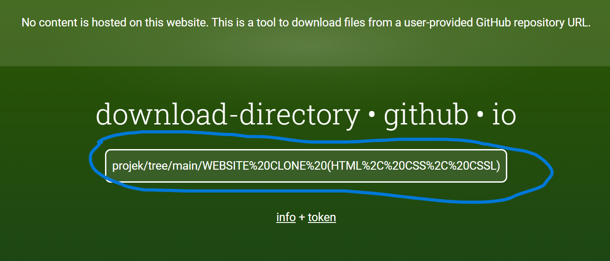
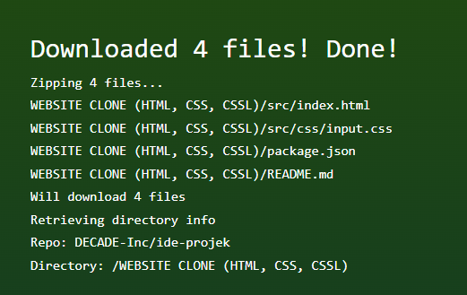

# Ide-Ide Projek
Isinya template buat tugas mingguan untuk memenuhi target mingguan. **Disarankan tidak menggunakan AI**. Gunakan search engine (google) dan dokumentasi dari internet.

Silahkan buka link materi belajar yang udah disediakan [disini](https://github.com/DECADE-Inc/link-materi-belajar)

## Tag Prerequisite - Prasyarat

Projek-projek di dalam sini baru bisa dikerjain kalau udah menguasai tag materi yang ada dibawah ini:

- **HTML** : menguasai html dasar.
- **CSS** : menguasai css dasar.
- **CSSL** : menguasai css layouting.
- **JS** : menguasai javascript dasar.
- **JSDOM** : menguasai javascript DOM.
- **PHP** : menguasai php dasar.
- **LBLADE** : menguasai template engine blade dari laravel.
- **LCONTROL** : menguasai fitur controller dari laravel.
- **LMODEL** : menguasai fitur model dan relasi dari laravel.
- **LAUTH** : menguasai starter kit laravel breeze untuk autentikasi.

## Cara Download Template
- Buka link github directory downloader [disini](https://download-directory.github.io/)
  
- Buka folder template yang mau dipakai di repositori github   

Contoh buka folder WEBSITE CLONE
  

- Copy alamat folder template yang mau di clone   

Contoh copy link folder WEBSITE CLONE
  

- Paste alamat folder template ke github directory downloader   

Contoh paste link folder WEBSITE CLONE
  

- Tekan enter, tunggu proses download selesai  

Tanda proses download berhasil
  
  
- Ekstrak folder dan ganti nama sesuai kebutuhan.

## Cara Menggunakan template

Bisa dibaca di file README.md di masing-masing direktori folder template buat tutorial instalasi template.

